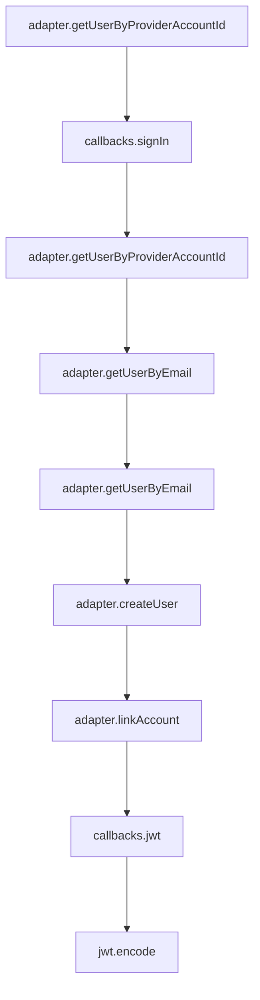

```mermaid
graph TD
    adapter1[adapter.getUserByProviderAccountId] ---> callbacksSignIn
    callbacksSignIn[callbacks.signIn] ---> adapter2
    adapter2[adapter.getUserByProviderAccountId] ---> adapter3
    adapter3[adapter.getUserByEmail] ---> adapter4
    adapter4[adapter.getUserByEmail] ---> adapter5
    adapter5[adapter.createUser] ---> adapter6
    adapter6[adapter.linkAccount] ---> callbacksJwt
    callbacksJwt[callbacks.jwt] ---> jwtEncode[jwt.encode]
```
